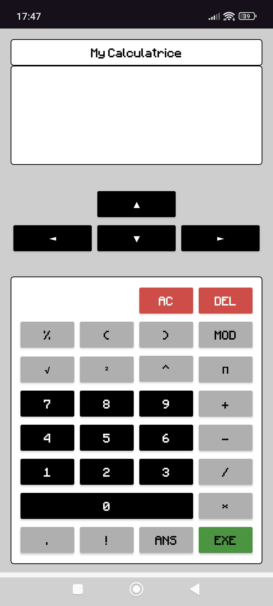

# My Calculatrice

Une application de calculatrice Android développée avec Java et Android Studio. Elle propose une interface inspirée du style "pixel art" pour un rendu rétro et minimaliste.

---

## Fonctionnalités

L'application est divisée en plusieurs sections interactives :

* **Opérations de base :** Addition, soustraction, multiplication et division.
* **Fonctions mathématiques :** * Calcul de modulo (MOD).
    * Mise au carré et puissance.
    * Calcul de factorielles (!) et constante Pi (π).
* **Navigation :** Pavé directionnel pour naviguer dans l'expression ou l'historique.
* **Mémoire :** Touche ANS pour récupérer le dernier résultat.
* **Interface :** Boutons colorés pour distinguer les actions (EXE pour valider, AC/DEL pour effacer).

> **Remarque :** Les touches de parenthèses `(` `)` ainsi que la touche racine carrée `√` sont présentes sur l'interface mais ne sont pas encore fonctionnelles dans cette version.

---

## Stack Technique

* **Langage :** Java
* **IDE :** Android Studio
* **Interface :** XML (Layouts personnalisés avec polices Pixel)
* **Compatibilité :** Android 5.0 (API 21) et versions supérieures

---

## Aperçu

<p align="center">
  
</p>

---

## Installation

1. Clonez le dépôt :
   ```bash
   git clone [https://github.com/votre-pseudo/my-calculatrice.git](https://github.com/votre-pseudo/my-calculatrice.git)
